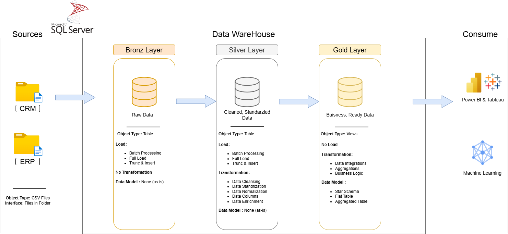

# Data Warehouse and Analytics Project

Welcome to my **Data Warehouse and Analytics Project** repository! 🚀

I'm **Ismail Laouad**, a Web and Mobile Application Development graduate with a strong interest in SQL development, data engineering, and database architecture.

This project demonstrates the development of a modern data warehouse using **Microsoft SQL Server**, following the Medallion Architecture. It covers data ingestion, data cleansing, transformation, data integration, and analytical data modeling using SQL.

The goal is to transform raw CRM and ERP data into a structured, business-ready data warehouse that supports analytical queries and reporting.

---

## 🏗️ Data Architecture

This project follows the **Medallion Architecture**, organized into three layers: Bronze, Silver, and Gold.



### 1. Bronze Layer — Raw Data

The Bronze Layer stores raw data ingested from CRM and ERP CSV files into SQL Server.

* Loads source data using SQL Server `BULK INSERT`.
* Preserves the original source structure.
* Uses stored procedures to orchestrate data loading.
* Implements execution logging, error handling, and batch duration tracking.

### 2. Silver Layer — Data Cleansing and Transformation

The Silver Layer prepares data for analytical use through data cleansing, standardization, and transformation.

* Handles data quality issues and inconsistent values.
* Standardizes customer, product, and sales data.
* Integrates CRM and ERP information.
* Applies SQL transformations to prepare reliable data for the Gold Layer.

### 3. Gold Layer — Business-Ready Data

The Gold Layer organizes the transformed data into analytical views designed for reporting and business analysis.

* Creates customer and product dimension views.
* Creates a sales fact view.
* Connects sales transactions to customer and product dimensions.
* Structures data following a star schema approach for analytical queries and reporting.

---

## 📖 Project Overview

This project focuses on the practical implementation of a SQL Server data warehouse.

### Key Components

* **Data Architecture:** Implementation of Bronze, Silver, and Gold layers.
* **ETL Development:** Loading and transforming CRM and ERP data using SQL Server stored procedures.
* **Data Quality:** Cleaning, standardizing, and integrating source data.
* **Data Modeling:** Building analytical dimensions and fact views.
* **SQL Development:** Writing joins, window functions, conditional logic, stored procedures, and data transformation queries.
* **Data Documentation:** Organizing SQL scripts and documenting the data warehouse architecture.

### 🎯 Skills Demonstrated

* SQL Server and T-SQL
* Data Warehousing
* ETL / ELT Concepts
* Data Cleansing and Transformation
* Stored Procedures and Error Handling
* Dimensional Modeling
* Star Schema
* Medallion Architecture
* Relational Database Design
* Git and GitHub

---

## 🛠️ Technologies and Tools
| Technology                          | Purpose                                              |
| ----------------------------------- | ---------------------------------------------------- |
| Microsoft SQL Server                | Data warehouse database                              |
| SQL Server Management Studio (SSMS) | Database development and administration              |
| T-SQL                               | Data loading, transformation, and analytical queries |
| SQL Server Stored Procedures        | ETL orchestration and processing                     |
| CSV Files                           | CRM and ERP source datasets                          |
| Draw.io                             | Data architecture and modeling diagrams              |
| Notion                              | Project task management and implementation roadmap   |
| Git and GitHub                      | Version control and project documentation            |

### Useful Resources

* [SQL Server Downloads](https://www.microsoft.com/en-us/sql-server/sql-server-downloads)
* [SQL Server Management Studio](https://learn.microsoft.com/en-us/ssms/download-sql-server-management-studio-ssms)
* [Draw.io](https://www.drawio.com/)
* [Microsoft SQL Server Documentation](https://learn.microsoft.com/en-us/sql/sql-server/)

---

## 🚀 Project Requirements

### Data Engineering — Building the Data Warehouse

**Objective:** Build a modern data warehouse using SQL Server to consolidate CRM and ERP sales-related data and prepare it for analytical reporting.

**Specifications:**

* **Data Sources:** Import CRM and ERP data from CSV files.
* **Data Quality:** Clean and standardize data before analytical use.
* **Data Integration:** Combine data from different source systems into a unified model.
* **Data Modeling:** Organize the Gold Layer into customer and product dimensions and a sales fact view.
* **ETL Processing:** Implement SQL scripts and stored procedures for data loading and transformation.
* **Logging and Error Handling:** Track ETL execution, processing duration, and errors.
* **Scope:** Focus on the latest dataset; historical data tracking is not a primary requirement.
* **Documentation:** Document the architecture, SQL scripts, and data model.

### Analytics and Reporting

The Gold Layer provides a foundation for analytical queries covering:

* Customer behavior and segmentation
* Product performance
* Sales amounts and quantities
* Sales trends over time

These analytical outputs can be used in reporting tools such as Power BI.

---

## 📂 Repository Structure

```text
DATAWarehouse/
│
├── datasets/
│   ├── source_crm/
│   └── source_erp/
│
├── docs/
│   ├── data_architecture.drawio
│   ├── data_flow.drawio
│   ├── data_models.drawio
│   └── data_catalog.md
│
├── scripts/
│   ├── bronze/
│   │   ├── ddl_bronze.sql
│   │   └── proc_load_bronze.sql
│   │
│   ├── silver/
│   │   ├── ddl_silver.sql
│   │   └── proc_load_silver.sql
│   │
│   └── gold/
│       └── ddl_gold.sql
│
├── tests/
│
├── README.md
├── LICENSE
└── .gitignore
```

*Note: This structure describes the intended organization. Adjust filenames and folders to match the files actually present in the repository.*

---

## 💻 Featured SQL Implementations

### Bronze Layer

* Raw data ingestion from CRM and ERP CSV files.
* Table loading using `BULK INSERT`.
* Batch execution logging and error handling.
* Stored procedure-based loading.

### Silver Layer

* Data cleansing and standardization.
* Customer and product data transformation.
* Sales data preparation.
* CRM and ERP data integration.

### Gold Layer

* `gold.dim_customers` — Customer dimension view.
* `gold.dim_products` — Product dimension view.
* `gold.fact_sales` — Sales fact view.

The Gold Layer uses dimension keys to connect sales records with customer and product information.

---

## 👨‍💻 About Me

Hi, I'm **Ismail Laouad**, a developer from Morocco with a background in .NET, web application development, and technical support for Sage 100.

I'm currently developing my skills in SQL Server, data warehousing, and data engineering through hands-on projects.

My technical interests include:

* SQL Development and Database Engineering
* Data Warehousing and ETL Pipelines
* Data Modeling and Analytics
* Python for Data Engineering
* Cloud Data Platforms and Distributed Data Processing

My long-term career goal is to grow into a **Data Engineer** role by building practical projects and strengthening my database, programming, and data processing skills.

### Connect With Me

* **LinkedIn:** [Ismail Laouad](https://www.linkedin.com/in/ismail-laouad-3a9741303)
* **GitHub:** [laouadismail333](https://github.com/laouadismail333)

---

## 📜 License

This project is intended for educational and portfolio purposes.

If you include a `LICENSE` file, make sure its terms match the license you have selected and that you have the right to redistribute the datasets and other included materials.

---

⭐ If you find this project useful, feel free to explore the SQL scripts and follow my progress as I continue learning data engineering.
